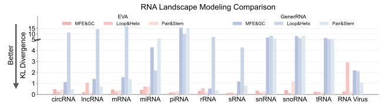
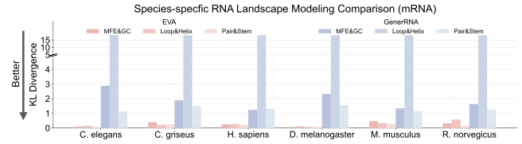
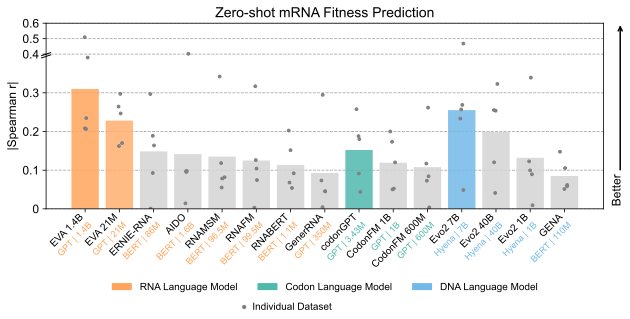
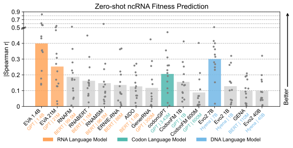
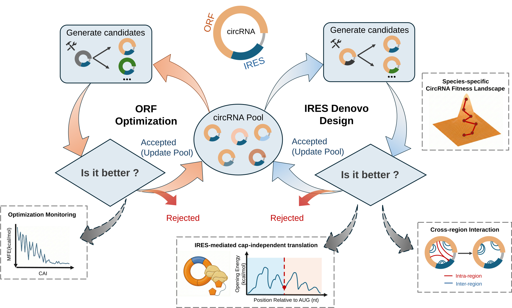
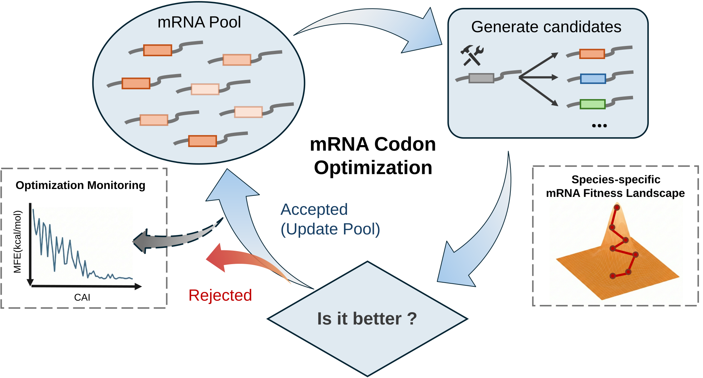
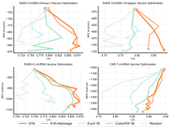
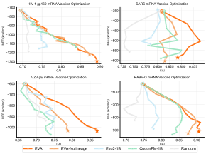

# Using EVA

Complete CLI reference for an installed [GPU runtime](INSTALLATION.md).
For a runnable paper example, see [Reproduction](REPRODUCTION.md).
Commands below use user-supplied input and checkpoint paths.

## Condition Control

EVA supports conditioning on **RNA type** and **species/lineage** for both generation (`generate.py`) and scoring (`predict.py`). These conditions can be used independently or combined.

### RNA Types

| RNA Type | Description |
|----------|-------------|
| mRNA | Messenger RNA - carries genetic information from DNA to ribosomes |
| tRNA | Transfer RNA - brings amino acids to the ribosome during translation |
| rRNA | Ribosomal RNA - forms the core of the ribosome structure |
| miRNA | MicroRNA - regulates gene expression |
| lncRNA | Long non-coding RNA - various regulatory functions |
| circRNA | Circular RNA - circularized RNA molecules |
| snoRNA | Small nucleolar RNA - modifies other RNAs |
| snRNA | Small nuclear RNA - involved in splicing |
| piRNA | PIWI-interacting RNA - silences transposons |
| sRNA | Small RNA - general category for small RNA molecules |
| viral_RNA | RNA from viruses |

### Species/Lineage

Species can be specified in three ways: `--taxid`, `--species`, or `--lineage` (Greengenes format).

Common species:

| TaxID | Species |
|-------|---------|
| 9606 | Homo sapiens (Human) |
| 10090 | Mus musculus (Mouse) |
| 10116 | Rattus norvegicus (Rat) |
| 7227 | Drosophila melanogaster (Fruit fly) |
| 6239 | Caenorhabditis elegans (Nematode) |
| 3702 | Arabidopsis thaliana (Plant) |
| 4932 | Saccharomyces cerevisiae (Yeast) |
| 562 | Escherichia coli (Bacteria) |

<br>

## Generation

See the paper for the evaluated datasets, metrics and comparisons.

<table>
  <tr>
    <td align="center" width="50%">
      
      <br><i>RNA landscape modeling comparison</i>
    </td>
    <td align="center" width="50%">
      
      <br><i>Species-specific modeling comparison</i>
    </td>
  </tr>
</table>

### CLM

CLM (Causal Language Model) generates RNA sequences autoregressively from left to right. This is the primary generation mode in EVA.

#### Unconditional Generation

Generate sequences without any biological constraints:

```bash
eva-generate \
    --checkpoint /path/to/model \
    --format clm \
    --num_seqs 1000 \
    --output /output/unconditional.fa
```

#### Conditional Generation

EVA supports conditioning on **RNA type**, **species** (via TaxID, species name, or lineage string), or both. See [Condition Control](#condition-control) for the full list of supported RNA types and species.

<div align="center">
  
</div>

```bash
# RNA type only
eva-generate \
    --checkpoint /path/to/model \
    --format clm \
    --rna_type mRNA \
    --num_seqs 1000 \
    --output /output/mrna.fa

# Species only (via TaxID)
eva-generate \
    --checkpoint /path/to/model \
    --format clm \
    --taxid 9606 \
    --num_seqs 1000 \
    --output /output/human.fa

# Both RNA type and species
eva-generate \
    --checkpoint /path/to/model \
    --format clm \
    --rna_type mRNA \
    --taxid 9606 \
    --num_seqs 1000 \
    --output /output/human_mrna.fa
```

Species can also be specified via `--species homo_sapiens` or `--lineage "D__Eukaryota;P__Chordata;..."` in Greengenes format.

<div align="center">
  
</div>

#### Continuation Mode

Extend existing sequences in either direction. Use `--split_ratio` (fraction) or `--split_pos` (exact position) to control the split point.

**Forward** (extend 3' end):

```bash
eva-generate \
    --checkpoint /path/to/model \
    --format clm \
    --input /input/partial_seq.fa \
    --direction forward \
    --split_ratio 0.5 \
    --num_seqs 5 \
    --output /output/continuation.fa
```

**Reverse** (extend 5' end):

```bash
eva-generate \
    --checkpoint /path/to/model \
    --format clm \
    --input /input/partial_seq.fa \
    --direction reverse \
    --split_pos 699 \
    --num_seqs 20 \
    --output /output/reverse_continuation.fa
```

Add `--output_details` to include prompt, ground truth, and generated content in the output.

### GLM

GLM (General Language Model) performs span infilling — it masks a region within an existing sequence and generates what should fill the gap based on surrounding context. Like CLM, GLM supports both unconditional and conditional generation.

#### Unconditional Infilling

Fill in a masked region without any biological constraints:

```bash
eva-generate \
    --checkpoint /path/to/model \
    --format glm \
    --input /input/sequences.fa \
    --span_ratio 0.1 \
    --num_seqs 5 \
    --output /output/glm_output.fa
```

#### Conditional Infilling

Condition on RNA type and/or species to generate biologically consistent infills:

```bash
eva-generate \
    --checkpoint /path/to/model \
    --format glm \
    --input /input/sequences.fa \
    --rna_type mRNA \
    --taxid 9606 \
    --span_ratio 0.2 \
    --num_seqs 5 \
    --output /output/glm_conditional.fa
```

#### Span Parameters

| Parameter | Description | Example |
|-----------|-------------|---------|
| `--span_length` | Fixed number of nucleotides to mask | `--span_length 20` |
| `--span_ratio` | Fraction of sequence to mask | `--span_ratio 0.1` |
| `--span_position` | Where to place the span: `random` or specific index | `--span_position 100` |
| `--span_id` | Which span token to use: `random` or 0-49 | `--span_id 0` |

### Sampling Parameters

| Parameter | Description | Recommended Range |
|-----------|-------------|------------------|
| `--temperature` | Controls randomness. Lower = more deterministic, higher = more diverse | 0.1 - 1.5 |
| `--top_k` | Only consider the top k most likely nucleotides at each position | 10 - 100 |
| `--top_p` | Nucleus sampling — consider smallest set of nucleotides whose cumulative probability exceeds p | 0.8 - 0.95 |

Example with all sampling parameters:

```bash
eva-generate \
    --checkpoint /path/to/model \
    --format clm \
    --temperature 0.8 \
    --top_k 50 \
    --top_p 0.9 \
    --num_seqs 100 \
    --output /output/sampled.fa
```

<br>

## Scoring

EVA provides sequence log-likelihood scores. Fitness comparisons depend on the
assay and scoring protocol; use the [benchmark guide](BENCHMARK_PROTOCOLS.md)
for paper-specific calculations.

<table>
  <tr>
    <td align="center">
      
    </td>
    <td align="center">
      
    </td>
  </tr>
</table>

Evaluate how well a given sequence fits the model's learned distribution by computing its log-likelihood. Higher (less negative) scores indicate more probable sequences.

### RNA Mode

Score RNA sequences and compute per-sequence log-likelihood:

```bash
eva-predict \
    --checkpoint /path/to/model \
    --input /input/sequences.fa \
    --output /output/scores.json
```

Supports `--rna_type` and `--taxid` conditioning, same as generation.

### Protein Mode

Score protein sequences by reverse-translating them to RNA first:

```bash
eva-predict \
    --checkpoint /path/to/model \
    --input /input/proteins.fa \
    --output /output/protein_scores.json \
    --mode protein \
    --codon_optimization first
```

`--codon_optimization` options: `first` (first codon in table) or `most_frequent` (most common codon for the species).

<br>

## Directed Evolution

EVA supports in-silico directed evolution — an iterative optimization pipeline that improves a given RNA sequence through cycles of mutation, LLM-based fitness scoring, and structural stability evaluation. Starting from an existing RNA sequence, EVA applies point mutations at specified positions, scores each mutant by log-likelihood and Minimum Free Energy (MFE via ViennaRNA), and uses simulated annealing with dynamic beam search to balance exploration and exploitation. Over multiple rounds the temperature cools to converge on optimized sequences, and the top N candidates ranked by combined LLM + MFE score are returned.

<table>
  <tr>
    <td align="center" width="50%">
      
    </td>
    <td align="center" width="50%">
      
    </td>
  </tr>
  <tr>
    <td align="center" width="50%">
      
    </td>
    <td align="center" width="50%">
      
    </td>
  </tr>
</table>

### Usage

```bash
eva-evolve \
    --checkpoint /path/to/model \
    --input /input/sequence.fa \
    --output /output/evolved.fa \
    --rna_type mRNA \
    --taxid 9606 \
    --iterations 10 \
    --mutations 5 \
    --beam_width 10 \
    --output_count 5
```

### Key Parameters

| Parameter | Description | Default |
|-----------|-------------|---------|
| `--iterations` | Number of evolution cycles | 10 |
| `--mutations` | Total mutations per iteration | 2 |
| `--beam_width` | Beam search width — keeps top candidates after each position | 10 |
| `--output_count` | Number of final sequences to output | 5 |
| `--T_init` / `--T_min` | Simulated annealing temperature range | 1.0 → 0.01 |
| `--cooling_rate` | Temperature decay per iteration | 0.95 |
| `--mutate_positions` | Specific positions to mutate (0-based, comma-separated) | Random |
| `--mutate_range` | Range of positions to mutate (e.g., `0-100`) | Entire sequence |

<br>

## Batch Processing with YAML

Define multiple tasks in a single YAML config file. The `defaults` section sets shared parameters, which individual tasks can override.

### Generation Config Example

```yaml
checkpoint: /path/to/model
output_dir: ./output

defaults:
  temperature: 1.0
  top_k: 50
  max_length: 8192
  batch_size: 1

tasks:
  - name: unconditional
    mode: generation
    format: clm
    num_seqs: 1000

  - name: human_mrna
    mode: generation
    format: clm
    rna_type: mRNA
    taxid: "9606"
    lineage: "D__Eukaryota;P__Chordata;C__Mammalia;O__Primates;F__Hominidae;G__Homo;S__Homo sapiens"
    num_seqs: 1000

  - name: glm_infill
    mode: generation
    format: glm
    input: ./input/seqs.fa
    span_ratio: 0.1
    num_seqs: 5
```

### Scoring Config Example

```yaml
checkpoint: /path/to/model
output_dir: ./scores

defaults:
  batch_size: 128

tasks:
  - name: score_basic
    mode: scoring
    input: ./input/seqs.fa

  - name: score_human_mrna
    mode: scoring
    input: ./input/seqs.fa
    rna_type: mRNA
    taxid: "9606"
    normalize: true
    exclude_special_tokens: true

  - name: score_protein
    mode: scoring
    input: ./input/proteins.fa
    scoring_mode: protein
    codon_optimization: first
```

### Running

```bash
eva-generate --config config.yaml              # Run all tasks
eva-generate --config config.yaml --task name   # Run specific task
eva-generate --config config.yaml --device cuda:1  # Override device
```

<br>

## Input/Output Formats

### Input — FASTA

```
>sequence_id_1
AUGCGCUAUGCGCUAUGCGCUAUGCGCUAUGCGCUAUGCGCUAUGCGCU
>sequence_id_2
AUGAAAAUGCGGCCGCAUUACGUAAACGGCCGCAAAUGUUUCCGGCAAA
```

### Output — Generation (FASTA)

```
>unconditional_0
AUGCGCUAUGCGCUAUGCGCUAUGCGCUAUGCGCUAUGCGCUAUGCGCU
```

With `--output_details` (GLM / Continuation):

```
>test_seq_sample0_forward_split50
PROMPT: AUGCGCUAUGCGCUAUGCG
GROUND_TRUTH: CU AUGCGCUAUGCG
GENERATED: CU AAUGCGCUAGCG
FULL_SEQ: AUGCGCUAUGCGCUAAUGCGCUAGCG
```

### Output — Scoring (JSON)

```json
{
  "scores": [
    {
      "header": "seq1",
      "sequence": "AUGGCCGUAGU...",
      "length": 67,
      "log_likelihood": -1.25
    }
  ]
}
```

Higher (less negative) `log_likelihood` means a more probable sequence under the selected model and protocol; it is not a universal measure of experimental fitness.

### Output — Directed Evolution (FASTA)

Output is in FASTA format with scores in the header:

```
>candidate_1_score=-125.4321_best
AUGC... (evolved sequence)
>candidate_2_score=-128.1056
AUGC... (second best)
```

<br>
